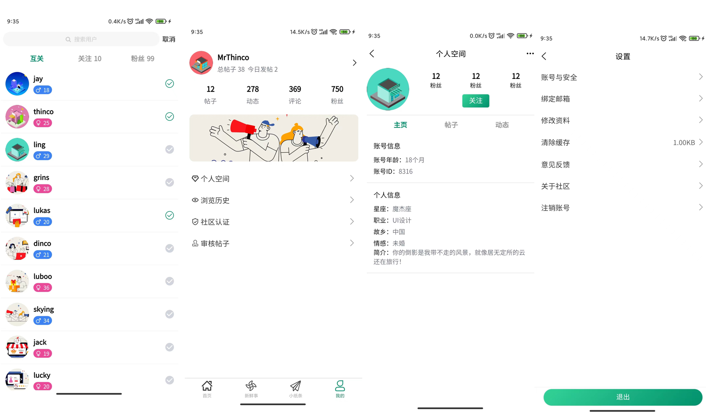

[TOC]
# 一、项目介绍
1. 项目描述：【share-bbs 社交论坛】是一套采用“uni-App”开发的分享社交论坛，兼容Android、IOS、微信小程序。 
2. 仓库地址：https://gitee.com/mrthinco/share-bbs
3. 代码说明：此项目为纯前端项目，不含后端、数据库等（方便本地运行、学习、复用）。
4. 技术框架：前端：uni-app,vue.js,uViewUI。
5. 项目展示：




# 二、目录说明
## 2.1 目录
```
share-bbs
├─ components // 组件库
   ├─ com-* // 公共组件
   ├─ 页面名称-* // 页面组件
   └─ uni-* // uni组件
├─ pages // 页面
   ├─ index // 首页模块
   ├─ news // 新鲜事模块 
   ├─ paper // 小纸条模块
   └─ mine // 我的模块
├─ static // 静态资源, 存放应用引用的本地静态资源（如图片、视频等）的目录，注意：静态资源只能存放于此
   ├─ css // css样式库
     ├─ thinco.css：样式库（自定义）
     ├─ animate.css：动画库（第三方）
     ├─ iconfont.css：自定义图标库（第三方）
   └─ uni.css： 官方UI库（第三方）
   ├─ font // 字体文件
   └─ img // 图片文件
├─ utils // js工具库
├─uni_modules // 存放[uni_module](/uni_modules)
├─platforms // 存放各平台专用页面的目录
├─nativeplugins // App原生语言插件
├─hybrid // App端存放本地html文件的目录
├─wxcomponents // 存放小程序组件的目录
├─unpackage // 非工程代码，一般存放运行或发行的编译结果
├─AndroidManifest.xml // Android原生应用清单文件
├─main.js // Vue初始化入口文件
├─App.vue // 应用配置，用来配置App全局样式以及监听 应用生命周期
├─manifest.json // 配置应用名称、appid、logo、版本等打包信息
├─pages.json // 配置页面路由、导航条、选项卡等页面类信息
└─uni.scss // 这里是uni-app内置的常用样式变量 
```

## 2.2 pages 模块/页面
1. home 首页
2. news 新鲜事
3. paper 小纸条
4. mine 个人中心

## 2.3 components 组件
### 2.3.1 组件命名规范
1. 组件名称：小驼峰，尽量语义化，如：`orderList`
2. 组件文件：组件名称/组件名称.vue，一个组件对应一个文件夹，该文件夹下可以有多个类型的文件（如：js、img、css等）。如：`orderList/orderList.vue`

### 2.3.2 组件存放规范
1. uni-ui组件或者三方组件直接存放为：`components/uni-*`(遵循：easycom规则)  
在使用 uni-ui 的时候，只要uni-ui组件 安装在项目的 components 目录下,并符合 components/组件名称/组件名称.vue 目录结构。就可以不用引用、注册，直接在页面中使用 uni-ui 组件。
2. 自定义公共复用组件存放为：`components/com*/com*.vue` (遵循：easycom规则)   
这里存放自定义复用组件，方便大家开发和复用、共享。如果要修改，uni-ui组件，也建议复制粘贴到这里，然后自定义修改，避免去uni-ui中直接修改，因为后面uni官方组件升级后会导致之前的自定义代码丢失。
3. 自定义非公共组件存放到：`当前页/cpns`，因为有的页面组件，其他页面根部就不会复用到，只是为了让主页面代码简洁和便于维护，那么这些组件，应该直接放到当前页下的`cpns`文件夹中，独立维护。

### 2.3.3 组件说明规范
每个自定义组件，组件用法、参数描述应该简单、清晰，应该在组件代码的`<script>`标签内的第一行备注好：组件名称、组件描述、开发人员、组件参数等，因为时间可以淡忘一切，当然也可以让你淡忘掉之前你为什么要传这个参数。
```JavaScript
<script>
  /*
  * LoadMore 加载更多
  * @description 用于列表中，做滚动加载使用，展示 loading 的各种状态
  * @author 杰伦
  * @property {String} status = [more|loading|noMore] loading 的状态
  * 	@value more loading 前
  * 	@value loading loading 中
  * 	@value noMore 没有更多了
  * @property {Number} iconSize 指定图标大小
  */
</script>
```

## 2.4 static 静态资源
1. `static/font` 字体文件
2. `static/img` 图片文件
    * 建议图片能够放后端或者云存储的尽量就别放前端，减少包体积和优化加载速度 。
    * 图片如果是复用的图片，不属于某个页面独有的图片，直接放此目录。
    * 图片如果属于某个功能模块独有的，需要建立一个和模块名称同名的文件夹，再存于文件夹下。如：`static/img/order` 订单模块的图片。
3. `static/css` css样式库
    * /css/uni.css： 官方UI库（第三方）
    * /css/animate.css：动画库（第三方）
    * /css/iconfont.css：自定义图标库（第三方）
    * /css/thinco.scss：样式库（自定义）

## 2.5 store vuex缓存
我们采用分模块来管理各个vuex子模块，便于项目的维护和整合。
1. `index.js` 此文件是入口文件，方便整合和引入vuex模块
2. `modules/user.js`  此文件是用户信息相关vuex模块

# 三、配置插件
1. pages.json文件
因为有的页面取消了导航栏，导致没法直观的辨别页面是哪个页面，做啥的。
* 每个页面配置项，顶部应该备注该页面说明。
* 特别的参数项，应该备注参数说明。
```
{	// 分组选择
	"path": "pages/group/group-check-spec",
	"style": {
		"navigationStyle": "custom",  // 取消本页面的导航栏
		"backgroundColor": "transparent",
		"app-plus": {
			"animationType": "fade-in", // 设置fade-in淡入动画，为最合理的动画类型
			"background": "transparent", // 背景透明
			"backgroundColor": "rgba(0,0,0,0)", // 背景透明
			"popGesture": "none" // 关闭IOS屏幕左边滑动关闭当前页面的功能
		}
	}
}
```

# 四、命名规范
## 4.1 文件命名
`.vue/.css/.js`文件命名采用小驼峰，尽量语义化，如：userList.vue

## 4.2 CSS命名规范
* class、id命名采用小写字母加中划线，尽量语义化，前缀是类型，后面是操作。如：提交按钮 `btn-submit`。

## 4.3 JS命名规范
* js函数命名采用小驼峰，尽量语义化，如：`parseStartTag`。

# 五、版本规范
* 版本名称：2.220815.1
* 版本号：22208151
* 从左往右数字命名说明：
    * 第一位：2，表示当前大迭代版本号：2版本
    * 第二至七位：220815，表示当前的发版日期：22年08月15日
    * 第八位：1-9，表示本次上线版本的上架审核次数，默认为1，重新上架一次递增1，最高为9
    * 注意：版本号和版本名称是对应关系，版本名称用点号分割

# 六、代码提交
```html
<!--注意：冒号后有空格-->
git commit -m <type>(optional scope): <description>

<!--举例-->
git commit -m "feat(): 新增debounce函数"
git commit -m "fix(server): send cors headers"
git commit -m "feat(blog): add comment section"
git commit -m "chore: run tests on travis ci"

<!--type 类别：用于表明本次提交做了那种类型的改动。-->
- feat：新增功能
- fix：缺陷修复
- perf：性能优化
- refactor：重构代码(既没有新增功能，也没有修复 bug)
- style：不影响程序逻辑的代码修改(代码风格样式等，没有改变代码逻辑)
- docs：文档更新
- build：项目构建系统(例如 glup，webpack，rollup 的配置等)的提交
- revert：回滚某个更早之前的提交
- chore：不属于以上类型的其他类型
  
optional scope：一个可选的修改范围。用于标识此次提交主要涉及到代码中哪个模块。
description：一句话描述此次提交的主要内容，做到言简意赅。
```